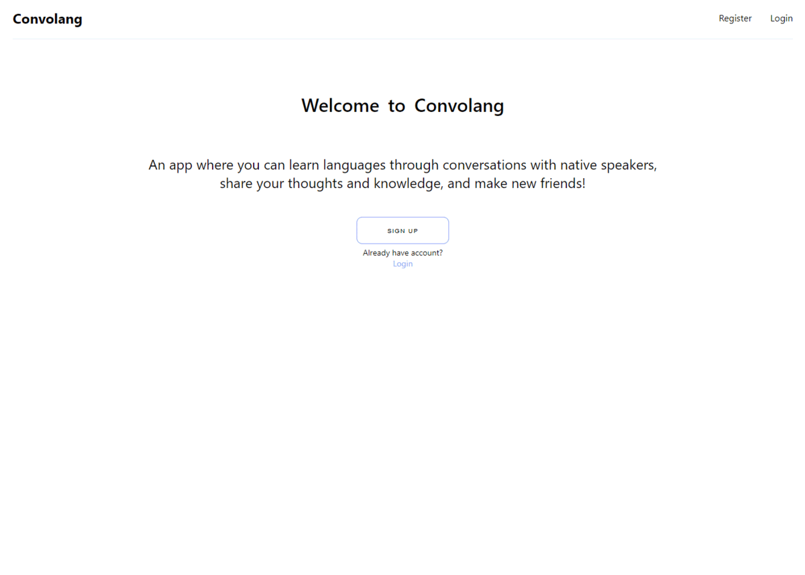

<p align="center">
  
</p>
An app for learning languages through conversations with native speakers and posting interesting updates from this amazing journey.

- Allows user to make posts and other users to comment on them.
- Discover people based on their native language and follow them to see the stories that they post.

## Preview
<p align="center">
  
</p>

## Installation
1. Clone the repo

```
git clone https://github.com/edakhmetov/convolang-project
cd convolang-project
```

2. Install dependencies for client
```
cd client
npm install
```

3. Install dependencies for server
```
cd serve
npm install
```

4. Create a .env file and fill it with information. Example provided in /server/.env.example

5. Start the application
```
cd serve
node index.js
```

```
cd client
npm run dev
```

## Tech Stack
#### Front-end
* [Next JS](https://nextjs.org/)
* [Typescript](https://www.typescriptlang.org/)
#### Back-end
* [Node JS](https://nodejs.org/en/)
* [Express](https://expressjs.com/)
* [PostgreSQL](https://www.postgresql.org/)

## Contributors

* Eduard Akhmetov - [GitHub](https://github.com/edakhmetov) - [LinkedIn](https://www.linkedin.com/in/cherl/)
* Maggie Reda - [GitHub](https://github.com/MagReda16) - [LinkedIn](https://www.linkedin.com/in/maggie-reda-990779231/)
* Ian Tang - [GitHub](https://github.com/ian-tang) - [LinkedIn](https://www.linkedin.com/in/oliniantang/)